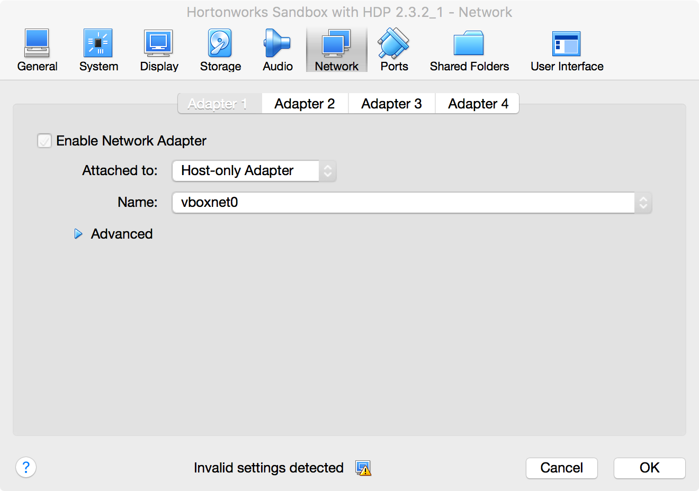
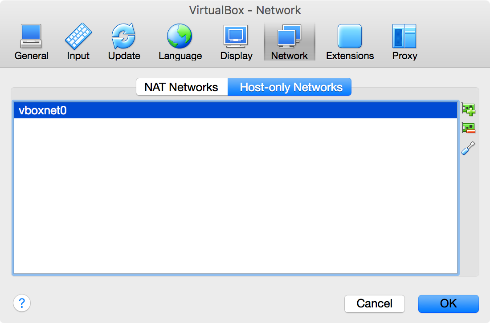
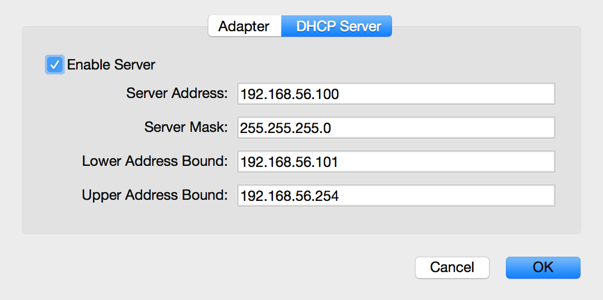

# Lab Environment Setup with Hortonworks Virtual Machine

## Instructions
1. Many of the labs in this course require the use of [Hortonworks Sandbox](http://hortonworks.com/products/hortonworks-sandbox) which is a virtual machine that has been configured with a Hadoop environment. It is the quickest way to get started with Big Data.

    At the time of this writing, the current version of Hortonworks Sandbox is **2.3.2**. If the current version available from Hortonworks is the *same*, please use [this link](http://hortonworks.com/products/hortonworks-sandbox/#install) to install the *VirtualBox* image. You will be required to register with Hortonworks before you can begin the download.


2. The lab instructions have been written and tested using the [VirtualBox](https://www.virtualbox.org) version of Hortonworks Sandbox. Please download and install the appropriate version for your operating system [at this link](https://www.virtualbox.org/wiki/Downloads).

3. Follow the Hortonworks Install Guide steps that have you select *Import Appliance* from VirtualBox. *Do not* power on your virtual machine after you have finished importing.

4. The virtual machine must be running with a *Host-only Adapter* configuration in VirtualBox. Select the *Settings* of the Hortonworks virtual machine and choose the *Network* tab to change from *NAT* to *Host-only Adapter*. (If you are doing this for the first time, you will not see `vboxnet0` as the listed adapter.) Make sure the _Enable Network Adapter_ is checked.

    

5. Next go into the *Preferences* for VirtualBox and select the Network tab. If you don't see the `vboxnet0`, click on the '+' button to create it.  Select `vboxnet0` and click on the *Edits selected host-only network* (the screwdriver button). Make note of the value of the *Lower Address Bound* IP address. In this case, the IP address in question is 192.168.56.101.

    
    

6. Many of the labs assume that `sandbox.hortonworks.com` resolves to the virtual machine. If you are on Mac OS X or Linux, open a terminal and use the _Lower Address Bound_ IP address from the previous step to make an entry to `/etc/hosts`. In this case, that IP is 192.168.56.101, but it could be different on your own computer.

    ```shell
    $ sudo sh -c "echo '192.168.56.101 sandbox.hortonworks.com' >> /etc/hosts"
    ```

    If you are on Windows, please search how to edit the hosts file for the particular version of Windows that is installed.

7. Boot the virtual machine.


## Accessing the Sandbox
Once started, you can access the virtual machine either through the [Ambari web UI](http://sandbox.hortonworks.com:8080) or through the terminal.

* To access via the terminal, use ssh to log into the virtual machine.

    ```shell
    $ ssh root@sandbox.hortonworks.com
    ```

    The default password is **hadoop** but you will be required to change it after logging in the first time.

* To access via Ambari, use the following URL: [http://sandbox.hortonworks.com:8080](http://sandbox.hortonworks.com:8080)
 - *User Name:* admin
 - *Password:* admin

Happy Hadooping!
