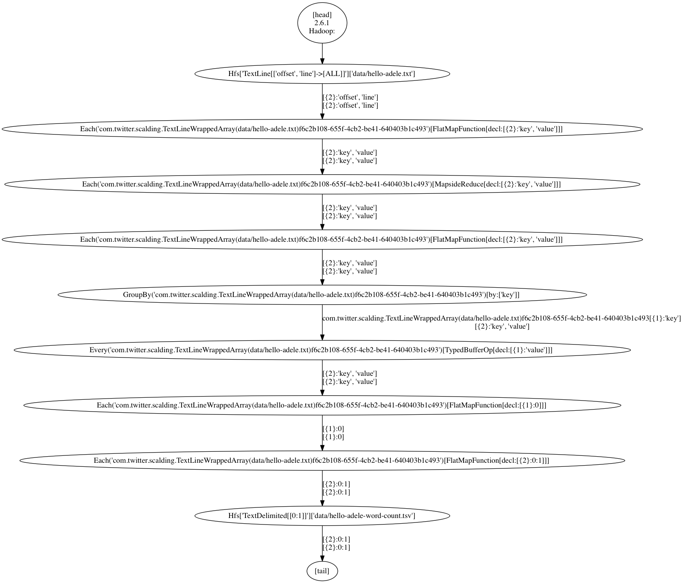

# WordCount in Scalding

In this lab, we will use Scalding to do the word count.

## Objectives

1. Understand the parts of Scalding programs.
2. Understand the process of building and running Scalding programs.
3. Execute scalding programs in local mode.
4. Understand the logging messages.


## Prerequisites

SBT is required for this exercise. The student may use any text editor; an IDE (Scala IDE, JetBrains IntelliJ, etc) is recommended, but not required.


## Review the Project Structure

### build.sbt

This file defines the dependencies for the project. The `build.sbt` is a file that you can use as a starting point for your projects.

Don't worry: you don't need to understand everything! The relevant part for us is the `libraryDependencies`: it lists the used libraries.

```
name := "lab-02-wordcount-scalding"
organization := "com.example"

version := "1.0"

scalaVersion := "2.11.7"

scalacOptions ++= Seq("-encoding", "utf-8", "-deprecation", "-unchecked", "-feature")

resolvers ++= Seq(
  "Concurrent Maven Repo" at "http://conjars.org/repo",
  "Twitter Maven Repo" at "http://maven.twttr.com"
)

libraryDependencies ++= Seq(
  "com.twitter" %% "scalding-core" % "0.15.0" exclude("com.esotericsoftware.minlog", "minlog"),
  "org.apache.hadoop" % "hadoop-client" % "2.2.0" % "provided",
  "org.slf4j" % "slf4j-log4j12" % "1.7.13" % "provided"
)


fork in (Compile, run) := true
mainClass in (Compile, run) := Some("com.twitter.scalding.Tool")
outputStrategy in (Compile, run) := Some(StdoutOutput)
javaOptions in (Compile, run) ++= Seq(
  "-Dlog4j.configuration=file:%s".format(baseDirectory.value / "log4j.properties"),
  "-Dcascading.update.skip=true",
  "-Dmapreduce.local.map.tasks.maximum=4"
)

run <<= Defaults.runTask(fullClasspath in Compile, mainClass in (Compile, run), runner in (Compile, run))

```


### plugins.sbt

`plugins.sbt`, in the `project` folder, contains information about the plugins used by the SBT. They expand the functionality of the tool.

This is a common setup used in the industry.

```
addSbtPlugin("org.scalariform" % "sbt-scalariform" % "1.4.0")
addSbtPlugin("com.github.gseitz" % "sbt-release" % "1.0.0")
addSbtPlugin("com.eed3si9n" % "sbt-assembly" % "0.13.0")
addSbtPlugin("net.virtual-void" % "sbt-dependency-graph" % "0.8.0")
```

We will see these plugins later in the lab.

### Other Files
Log4J is used as  a logging framework, there is the `log4j.properties` file.


### Review the Program

We provide two versions of the program:
- `WordCountShort` with skipped type declarations. They are inferred by the compiler.
- `WordCountExplicitTypes` with all types spelled out. This is a good way to confirm that you understand what is going on in the code, and compiler is there to validate the soundness. (Unfortunately, some of the compiler error messages could be a bit cryptic).


#### WordCountShort

Let's see the code, and then we will run it.

``` scala
package com.example

import com.twitter.scalding._

class WordCountShort(args: Args) extends Job(args) {

  def tokenize(text: String): Array[String] = {
    text.toLowerCase.replaceAll("[^a-zA-Z0-9\\s]", "").split("\\s+")
  }

  TypedPipe
    .from(TextLine(args("input")))
    .flatMap(tokenize(_))
    .groupBy(word => word)
    .size
    .write(TypedTsv(args("output")))

}

```


##### Run the Scalding Program in Local Mode

This is the mode you want to use for fast development.

In the terminal, run `sbt`. Then enter the command:

```
run com.example.WordCountShort --local --input data/hello-adele.txt --output data/hello-adele-word-count.tsv
```


This is not a plain Scala run! The `build.sbt` has the configuration to use the Scalding runner: `com.twitter.scalding.Tool`.

Parameters used:
- The option `--local` indicates the use of the local file system. The alternative is `--hdfs`.
- `--input` is the name of the argument that is passed into the program. Our value is the file from the `data` folder.
- `--output` is the also name of the argument that is passed into the program. It is the location for the output file.


When you enter the command, you should see output like this:

```
> run com.example.WordCountShort --local --input data/hello-adele.txt --output data/hello-adele-word-count.tsv
[info] Updating {file:.../lab-02-wordcount-scalding/}lab-02-wordcount-scalding...
[info] Resolving jline#jline;2.12.1 ...
[info] Done updating.
[info] Compiling 2 Scala sources to .../lab-02-wordcount-scalding/target/scala-2.11/classes...
[info] Running com.twitter.scalding.Tool com.example.WordCountShort --local --input data/hello-adele.txt --output data/hello-adele-word-count.tsv

... bunch of log4j info messages

```

..and then comes the interesting part about the execution of Cascading flows.

```
2016-01-19 18:20:14,361 INFO cascading.util.Version: Concurrent, Inc - Cascading 2.6.1
2016-01-19 18:20:14,363 INFO cascading.flow.Flow: [com.example.WordCountS...] starting
2016-01-19 18:20:14,364 INFO cascading.flow.Flow: [com.example.WordCountS...]  source: FileTap["TextLine[['offset', 'line']->[ALL]]"]["data/hello-adele.txt"]
2016-01-19 18:20:14,364 INFO cascading.flow.Flow: [com.example.WordCountS...]  sink: FileTap["TextDelimited[[0:1]]"]["data/hello-adele-word-count.tsv"]
2016-01-19 18:20:14,364 INFO cascading.flow.Flow: [com.example.WordCountS...]  parallel execution is enabled: true
2016-01-19 18:20:14,364 INFO cascading.flow.Flow: [com.example.WordCountS...]  starting jobs: 1
2016-01-19 18:20:14,364 INFO cascading.flow.Flow: [com.example.WordCountS...]  allocating threads: 1
2016-01-19 18:20:14,370 INFO cascading.flow.FlowStep: [com.example.WordCountS...] starting step: local

```

Notice the `FileTap` sources and sinks.

The result of the program is in the `hello-adele-word-count.tsv` file:

```
about	2
after	1
aint	1
all	1
...
```

##### Run the Scalding Program in MapReduce Mode

We will use Hadoop MapReduce and use HDFS. Let's re-run the command, but with the `--hdfs` option:

```
2016-01-19 18:27:04,701 INFO cascading.flow.hadoop.FlowReducer: sourcing from: GroupBy(com.twitter.scalding.TextLineWrappedArray(data/hello-adele.txt)89763e71-3f91-4c6e-a6a8-11703567be08)[by:[{1}:'key']]
2016-01-19 18:27:04,701 INFO cascading.flow.hadoop.FlowReducer: sinking to: Hfs["TextDelimited[[0:1]]"]["data/hello-adele-word-count.tsv"]
2016-01-19 18:27:04,747 INFO org.apache.hadoop.mapred.Task: Task:attempt_local2132252675_0001_r_000000_0 is done. And is in the process of committing
2016-01-19 18:27:04,748 INFO org.apache.hadoop.mapred.LocalJobRunner:
2016-01-19 18:27:04,748 INFO org.apache.hadoop.mapred.Task: Task attempt_local2132252675_0001_r_000000_0 is allowed to commit now
2016-01-19 18:27:04,751 INFO org.apache.hadoop.mapreduce.lib.output.FileOutputCommitter: Saved output of task 'attempt_local2132252675_0001_r_000000_0' to file:/Users/vladimir/_data/Dropbox/SciSpike (1)/CourseWare/Courses/PayPal Big Data 20151117/Scalding/lesson-400-scalding-overview/lab-02-wordcount-scalding/data/hello-adele-word-count.tsv/_temporary/0/task_local2132252675_0001_r_000000
2016-01-19 18:27:04,751 INFO org.apache.hadoop.mapred.LocalJobRunner: reduce > reduce
2016-01-19 18:27:04,751 INFO org.apache.hadoop.mapred.Task: Task 'attempt_local2132252675_0001_r_000000_0' done.
2016-01-19 18:27:09,263 INFO cascading.tap.hadoop.util.Hadoop18TapUtil: deleting temp path data/hello-adele-word-count.tsv/_temporary
[success] Total time: 8 s, completed Jan 19, 2016 6:27:09 PM

```

In the log, you will notice the use of mappers and reducers.

The output is not a simple file any more: it is a folder with the content like this:

```
._SUCCESS.crc
.part-00000.crc
_SUCCESS
part-00000
```

`part-00000` contains the data.


#### WordCountExplicitTypes

Check out the types in the following code. We have spelled them all out, but this would be an overkill in a real program. However, the types increase our confidence that we understand the kinds of data flowing through the system.


``` scala
package com.example

import com.twitter.scalding._
import com.twitter.scalding.typed.UnsortedGrouped

class WordCountExplicitTypes(args: Args) extends Job(args) {

  def tokenize(text: String): Array[String] = {
    text.toLowerCase.replaceAll("[^a-zA-Z0-9\\s]", "").split("\\s+")
  }

  val words: TypedPipe[String] = TypedPipe
    .from(TextLine(args("input")))
    .flatMap(tokenize(_))

  val groups: Grouped[String, String] = words.groupBy(_.toLowerCase)

  val counts: UnsortedGrouped[String, Long] = groups.size

  counts.write(TypedTsv[(String, Long)](args("output")))

}
```


## Assemblying the Fat Jar file

In `sbt`, run the task `assembly`. This will create a fat jar - with all dependencies included!

You will see something like this:

```
> assembly
[info] Updating {file: ...}lab-02-wordcount-scalding...
[info] Resolving jline#jline;2.12.1 ...
[info] Done updating.
[info] Compiling 1 Scala source to .../lab-02-wordcount-scalding/target/scala-2.11/classes...
[info] Including: slf4j-api-1.6.6.jar
[info] Including: commons-compiler-2.7.5.jar
[info] Including: asm-4.0.jar
[info] Including: scalding-date_2.11-0.15.0.jar
[info] Including: cascading-hadoop-2.6.1.jar
...

[info] Packaging .../lab-02-wordcount-scalding/target/scala-2.11/lab-02-wordcount-scalding-assembly-1.0.jar ...
[info] Done packaging.
[success] Total time: 19 s, completed Jan 19, 2016 7:02:57 PM

```

This creates the `lab-02-wordcount-scalding-assembly-1.0.jar` file that we can deploy to a Hadoop cluster.


## Inspecting the Execution Flows

Scalding can create graph which shows the execution flows on Hadoop cluster. The created graph is in the `.dot` format, which you can open with [Graphviz](http://www.graphviz.org).

Run the program with the `--tool.graph` option. The program will not run, but it will create two files with the `.dot` extension in the root folder of the project.

```
run com.example.WordCountShort --hdfs --input data/hello-adele.txt --output data/hello-adele-word-count.tsv --tool.graph
```

This makes the files:
```
com.example.WordCountShort0.dot
com.example.WordCountShort0_steps.dot

```

Open them in Graphviz.

##### com.example.WordCountShort0.dot



We can see the steps in the underlying Cascading terminology.

##### com.example.WordCountShort0_steps.dot


We can see the source, the group, and the sink.

These graphs can be used to optimize MapReduce execution by optimizing flows. Inefficient flows could be recognized and refactored. One can also use (commercial) tools dedicated to optimization of Hadoop jobs.


## Other Useful SBT Plugins for Scalding Projects

In SBT, we have added two useful plugins, which are not strictly necessary, but many teams use them in their Scalding projects.

#### Scalariform
[Scalariform](https://github.com/scala-ide/scalariform) is a Scala source code formatter. There is a rich set of rules that can be configured. We run it automatically as a part of a build. This provides for uniform look of code for the whole team.

#### SBT Dependency Graph
`sbt-dependency-graph` adds a task that let you visualize dependencies. In sbt, run the command `dependencyGraph`:

```
> dependencyGraph
[info] Updating {file:.../lab-02-wordcount-scalding/}lab-02-wordcount-scalding...
[info] com.example:lab-02-wordcount-scalding_2.11:1.0 [S]
[info]   +-com.twitter:scalding-core_2.11:0.15.0 [S]
[info]     +-cascading:cascading-core:2.6.1
[info]     | +-org.codehaus.janino:janino:2.7.5
[info]     | | +-org.codehaus.janino:commons-compiler:2.7.5
[info]     | |
[info]     | +-riffle:riffle:0.1-dev
[info]     | +-thirdparty:jgrapht-jdk1.6:0.8.1
[info]     |
[info]     +-cascading:cascading-hadoop:2.6.1
[info]     | +-cascading:cascading-core:2.6.1
[info]     |   +-org.codehaus.janino:janino:2.7.5
[info]     |   | +-org.codehaus.janino:commons-compiler:2.7.5
[info]     |   |
...
```
This can come handy when working on large projects. We will not use this in our exercises.

## Conclusion

Congratulations! You are running Scalding now. These steps will apply to other Scalding programs. In the next sections you will learn more about data transformations and other APIs.
